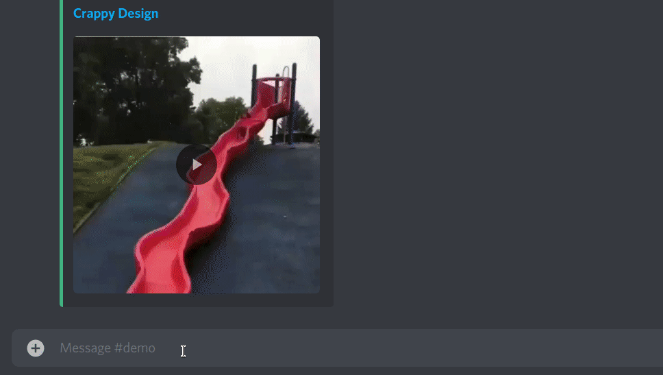

# GiveMeOne

Faster Searching

This flask server uses the Google Image API to search for whatever search term you put at the end of the url, and redirects directly to the first result

ie if you wanted to search for 'many puppies' you would use "**http://server.address/many-puppies**" and it would resolve directly to the first image, like so 

**( This is just a demo URL, I don't have a live public version ready yet :) )**

## Config

A **config.json** file will be generated on first use, you will need to fill this out.

### API

**api_key**: This is where your google images API key goes

### Config

**database**: Link to your mongoDB link cache database if you use this method for link caching

**link_cache**: (db, json) This determines if you would like to use a local json file for the link cache, or use a mongoDB database

**notes:**

Unfortunately, I don't think I will be able to reliably host this myself, as the fees for using the API are far too much for me to afford right now, ($5 per 1k calls, and if it reaches the level of use as twitfix has, it would cost me over $150 a month, and as a person with no income, that doesn't really work)

I am making this open source and licensing it under the **WTFPL**, so if anyone else would like to run this, please feel free to do so, and let me know too.
